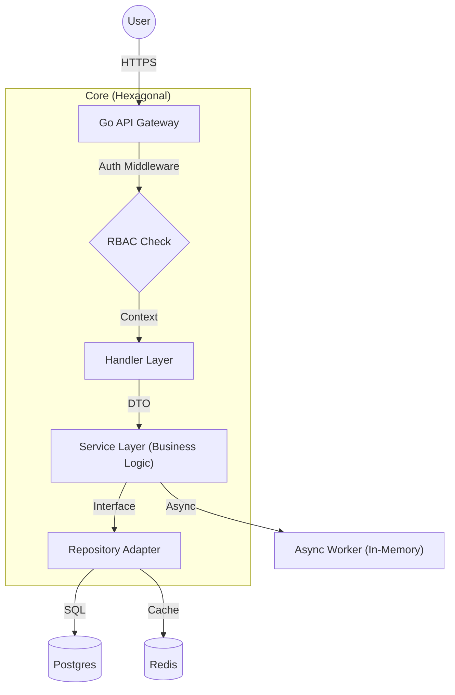

# Production SaaS Starter Kit
 
 [](https://goreportcard.com/report/github.com/moasq/production-saas-starter)
 [](https://opensource.org/licenses/MIT)
 
 **The high-performance, self-hosted alternative to Indie Hacker boilerplates.**
 
 **Modular Monolith. Hexagonal Architecture. Enterprise practices for every scale.**


## 🔓 The "No Lock-In" Guarantee

This kit is built on a simple premise: **You own the infrastructure.**

Most "modern" stacks quietly lock you into Vercel, AWS Lambda, or Supabase. We give you standard, battle-tested Docker containers.

- **Ready to deploy anywhere:** Runs on a $5 DigitalOcean Droplet, AWS ECS, Google Cloud Run, or bare metal.
- **No "Serverless" Tax:** Usage costs don't scale exponentially with your traffic.
- **Full Control:** We provide standard `Dockerfiles`. Eject at any time.

## 💎 Business Value > Tech Specs

We chose boring, reliable technology so you can focus on building value.

| Capability | The Technical Reality | The Business Value |
| :--- | :--- | :--- |
| **Operational Stability** | Go (Golang) Backend | Compile to a single binary. Low memory footprint. High concurrency. |
| **Type-Safe Reliability** | SQLC + Postgres | Eliminate runtime SQL errors before they reach production. |
| **Gateway Security** | Middleware Pipeline | Zero-Trust pipeline handles Auth & RBAC before business logic executes. |
| **Cognitive Governance** | Hexagonal Architecture | Business logic is isolated from tools. Swap Stripe for Paddle without rewriting the core. |
| **Hermetic Dev** | Docker Compose | Onboarding a new dev takes 10 minutes, not 2 days. |

## ✨ Features Matrix

| Feature | Implementation | Description |
| :--- | :--- | :--- |
| **Multi-Tenancy** | ✅ Organization Isolation | Data is logically isolated by `organization_id`. |
| **RBAC** | ✅ Role-Based Access | Granular permission checks (`can:edit_billing`). |
| **AI & RAG** | ✅ LLM Pipeline | Pre-configured OpenAI/Mistral client with vector embeddings. |
| **OCR** | ✅ Document Parsing | Extract text from PDFs and Images instantly. |
| **File Storage** | ✅ S3 Compatible | Ready-to-use Cloudflare R2 / AWS S3 integration. |
| **Billing** | ✅ Merchant of Record | Integrated Subscriptions, Invoices, and Webhook Sync. |
| **Database** | ✅ Postgres + SQLC | Type-safe SQL. No GORM magic blackboxing. |
| **Cache** | ✅ Redis | Fast session management and caching. |

## 🏗 Architecture

We use a **Modular Monolith** structure. This gives you the code modularity of microservices without the operational complexity.




## 🚀 Getting Started
 
 ### 0. Prerequisites
 
 > [!IMPORTANT]
 > Before running any commands, please read **[SETUP.md](./SETUP.md)** to ensure your environment is ready.
 
 You will need:
 *   **Docker & Docker Compose** (Required for Database)
 *   **Go 1.25+** (Required for Backend)
 *   **Node.js 20+ & pnpm** (Required for Frontend)
 *   **Make** (Required for running commands)
 
 ### 1. The One-Line Setup
 This command sets executable permissions, generates local environment keys, and boots the infrastructure.
 
 ```bash
 # Make script executable and run it
 chmod +x setup.sh && ./setup.sh
 ```
 
 **What this script does:**
 
 1.  **Config:** Copies `.env.example` to `.env` (if missing).
 2.  **Infra:** Starts Postgres (Port 5432) & Redis (Port 6379) in Docker.
 3.  **Schema:** Runs `migrate up` to create tables.
 
 ### 2. Start the Servers
 
 Open two terminal tabs:
 
 **Backend:**
 ```bash
 cd go-b2b-starter
 make dev
 ```
 
 **Frontend:**
 ```bash
 cd next_b2b_starter
 pnpm dev
 ```
 
 ### 3. Verify it works
 
 *   **Frontend:** [http://localhost:3000](http://localhost:3000) (Login Screen)
 *   **Backend API:** [http://localhost:8080/health](http://localhost:8080/health) (Should return `{"status":"OK"}`)
 
 ### 🛑 Troubleshooting
 
 If the containers start but the app isn't working, view the logs:
 
 ```bash
 docker compose logs -f postgres
 # or
 make dev # Shows backend logs directly in terminal
 ```

## 🚀 Consulting & Services
 
 This kit is designed to be self-service, but growing startups often need specialized expertise to move faster.
 
 I accept a limited number of high-touch projects.
 
 ### How we can work together:
 
 1.  **Managed Deployment:**
     Skip the DevOps learning curve. I will provision your infrastructure (AWS, GCP, DigitalOcean), configure the production environment (Postgres, Redis, CI/CD), and hand you the keys to a live, secure application.
 
 2.  **Custom Feature Development:**
     Need advanced capabilities like **SAML/SSO**, **Usage-based Billing**, or **RAG Pipelines**? I will architect and implement these features directly into your repository, ensuring they fit the Hexagonal pattern perfectly.
 
 3.  **Architecture Migration & Audit:**
     Migrating from Node.js/Python or scaling a legacy Go app? I offer deep-dive code reviews and architectural roadmaps to ensure your system can handle the next 10x of growth.
 
 **Interested?**
Email me with a brief summary of your stack and your biggest current bottleneck.
 
 **[m.salim@apflowhq.com](mailto:m.salim@apflowhq.com)**
 
 ### Contact
 * **X (Twitter):** [**@foundmod**](https://x.com/foundmod) — *DMs Open*

```
