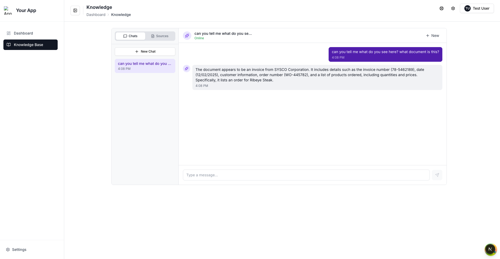

# ⭐ Production SaaS Starter Kit

A lean B2B SaaS boilerplate for founders. Built with **Next.js 16** and **Go 1.27**. Start with organization accounts, team management, and optional billing, then add your product.

[](https://goreportcard.com/report/github.com/moasq/production-saas-starter)
[](https://opensource.org/licenses/MIT)



*Dashboard preview from the original release; the starter now focuses on the core B2B features below.*

## 🛠️ Built With

### Frontend Stack

- **[Next.js 16](https://nextjs.org)** (v16.3.6)
  Modern React framework with App Router and API routes.
- **[React 19](https://react.dev)** (v19.3.0)
  React components and server-rendered pages.
- **[TypeScript](https://www.typescriptlang.org)** (v5.9.3)
  Type-safe JavaScript for enhanced developer experience.
- **[Tailwind CSS](https://tailwindcss.com)** (v3.4.19)
  Utility-first CSS framework for rapid UI development.
- **[shadcn/ui](https://ui.shadcn.com)** + **Radix UI**
  Accessible components for the dashboard, team management, and settings.
- **[TanStack Query](https://tanstack.com/query)** (v5.103.2)
  Powerful data fetching and state management.
- **[Stytch](https://stytch.com)**
  B2B magic-link authentication with server-managed sessions.
- **[Polar.sh](https://polar.sh)**
  Optional checkout and subscription management.

### Backend Stack

- **[Go 1.27.1](https://go.dev)**
  High-performance, concurrent backend with excellent tooling.
- **[Gin](https://gin-gonic.com)**
  Fast HTTP web framework with middleware support.
- **[PostgreSQL](https://www.postgresql.org)**
  Organization and account data, with migrations applied at startup.
- **[SQLC](https://sqlc.dev)**
  Type-safe SQL compiler for Go (no ORM).
- **[Stytch B2B](https://stytch.com)**
  Organization identity, membership, and provider-managed RBAC.
- **[Polar.sh](https://polar.sh)**
  Optional subscription status and customer portal integration.
- **[Docker](https://www.docker.com)** + **Docker Compose**
  One-command setup, with Caddy as the deployment entry point.

## 🥇 Features

- **Authentication**: Sign in with a magic link through Stytch B2B.
- **Multi-Tenancy**: Organization-scoped access enforced by the Go API.
- **Roles & Permissions**: Three roles (Member, Manager, Admin), with permissions managed by Stytch.
- **Billing & Subscriptions**: Optional Polar checkout, customer portal, and current subscription status.
- **Team Management**: Invite members, manage roles, and update settings.
- **Responsive Design**: Mobile-first UI built with Tailwind CSS and shadcn/ui.
- **Type Safety**: Generated SQLC database queries in Go and TypeScript in the frontend.

## ➡️ Coming Soon

Ideas for optional extensions, outside the minimal core:

- **Audit Logs**: Complete audit logging system for tracking user activities.
- **Webhooks UI**: Customer-facing webhook configuration.
- **Advanced Analytics**: Built-in charts and usage tracking.

## ✨ Getting Started

Please follow these simple steps to get a local copy up and running.

### Prerequisites

- **Docker** & **Docker Compose**

Docker is all you need for the default setup on Linux, macOS, or WSL. For local development outside containers, use **Go 1.27.1**, **Node.js 24 LTS**, and **pnpm 10.32.1**.

### The One-Line Setup

From the cloned repository, run this command to create a private `.env` and start the application:

```bash
./setup.sh
```

**After Setup:**

1. **Visit:** [http://localhost:3000](http://localhost:3000).
2. **Enable sign-in:** Add your Stytch B2B credentials and configure the roles and callback URLs in [SETUP.md](./SETUP.md), then run `docker compose up -d`. Until then, the app shows setup instructions.
3. **Enable billing when needed:** Configure Polar and set `BILLING_ENABLED=true`. Billing is disabled by default.

> [!IMPORTANT]
> See **[SETUP.md](./SETUP.md)** for quick setup or **[DEVELOPMENT.md](./DEVELOPMENT.md)** for comprehensive guidance including multi-platform prerequisites, troubleshooting, and daily workflow tips.

For the code structure, see [Architecture](docs/ARCHITECTURE.md). Existing installations should follow the [upgrade guide](docs/UPGRADING.md); completed checks and provider limitations are recorded in [Verification](docs/VALIDATION.md).

## 🛡️ License

[MIT License](./LICENSE)

## 👯 Consulting & Services

Although this kit is self-service, I help ambitious founders move faster.

**I can help you with:**

1.  **Managed Config:** I help set up your production environment and deployment workflow.
2.  **Custom Features:** Need SAML SSO or a custom B2B workflow? I'll build them directly into your repo.
3.  **Code Audits:** Migrating from Node/Python? I'll review your architecture for scale.

**[m.salim@apflowhq.com](mailto:m.salim@apflowhq.com)** • [**@foundmod**](https://x.com/foundmod)
